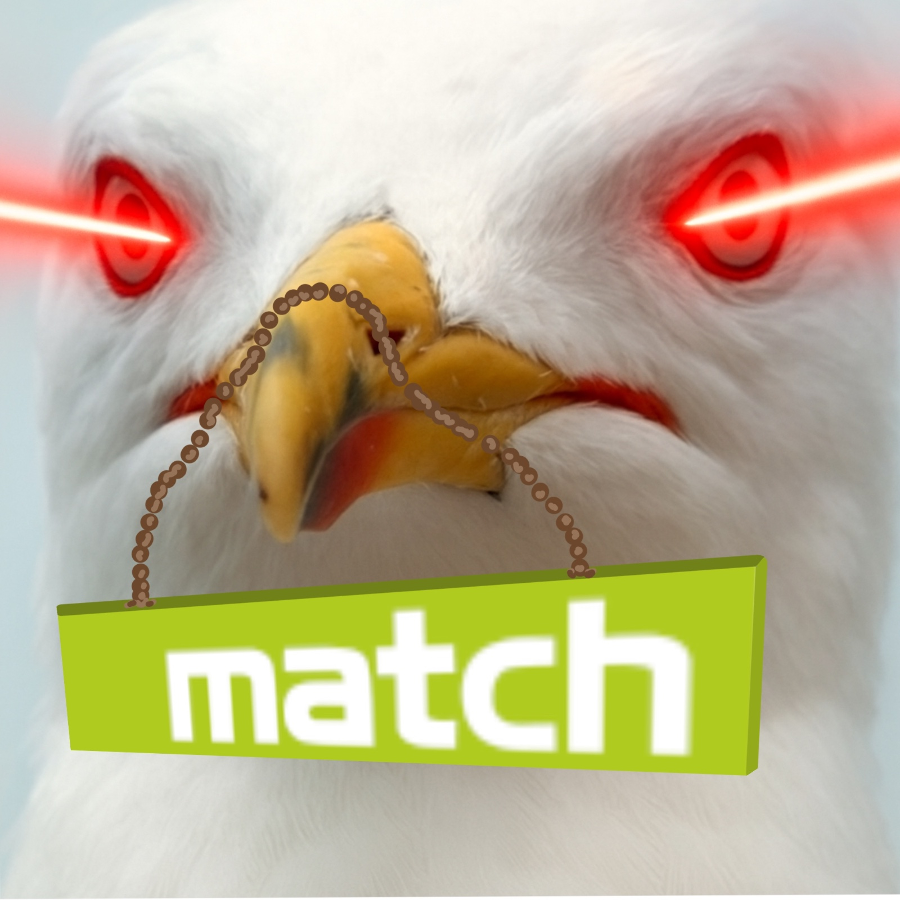

# Mächtige Match Möve Marvin

## 🚁 Overview

**Match Drohne** — aka. Marvin the Seagull.



---

## 📦 Installation

### 1. Navigate to the `src` Directory

```bash
cd /path/to/your/ros2_ws/src
```

### 2. Clone the Repository

```bash
git clone https://github.com/Luca0204/Match-Drohne .
```

### 3. PX4 Setup (10–15 minutes)

```bash
git clone https://github.com/PX4/PX4-Autopilot.git --recursive
cd PX4-Autopilot
touch COLCON_IGNORE
DONT_RUN=1 make px4_sitl gz_x500
```

### 4. Install MAVROS

```bash
sudo apt install -y ros-humble-mavros ros-humble-mavros-extras ros-humble-mavros-msgs
sudo apt install -y geographiclib-tools
sudo geographiclib-get-geoids egm96-5
```

### 5. Install QGroundControl
Für den Betrieb der Drohne wird QGroundControl benötigt. Damit lässt sich Telemetrie empfangen und Befehle an die Drohne senden. Auch im späteren Realbetrieb wird die Software verwendet.

<strong>Wichtig:</strong> Ohne eine verbundene QGroundControl-Instanz hebt die Drohne aus Sicherheitsgründen nicht ab. 

[QGroundControl Installation Guide](docs/QGroundControl.md)

### 6. Install Custom Models
Damit eigene Drohnenmodelle genutzt werden können, müssen einige Dateien in der Simulationsumgebung angepasst bzw. ergänzt werden. Zum Glück hat ein kleiner Tastatur-Affe (ich) dafür ein Skript gemacht:

```bash
cd /path/to/your/ros2_ws/src/match_models/
chmod +x install_models.sh
./install_models.sh
```

Anschließend muss der Simulator erneut gebaut werden. Das dauert diesmal nicht mehr so lange:

```bash
DONT_RUN=1 make px4_sitl gz_x500
```

<strong>Wichtig:</strong> Die Modelle werden von dem "install_models.sh" skript in Ordner des Simulators kopiert. Das heißt wenn man Modelle in "match_models/sdf" oder "match_models/worlds" verändert bekommt der Simulator davon nichts mit. Nur nach erneutem ausführen des "install_models.sh" Skripts werden veränderungen übernommen. 

Ein erneutes ausführen von "DONT_RUN=1 make px4_sitl gz_x500" ist bei einfachen veränderungen der SDF dateien nicht notwendig. Nur wenn man ganz neue Drohnen Varianten anlegt. Mehr details gibts hier: [Advanced Custom Modells Setup](docs/adv_drone_seup.md)

---

## 🚀 Running the Demo
Die Demo startet eins der Standardmodelle des Simulators, hebt ab, fliegt zwei meter nach vorne und landet. 

```bash
cd /path/to/your/ros2_ws/
colcon build --symlink-install
source install/setup.bash
ros2 launch match_launch x500.launch.py
```

---
## 🛠️ Custom Drone Model Setup

For instructions on setting up the custom drone model, see [match_models/Drone_Guide.md](match_models/Drone_Guide.md).


