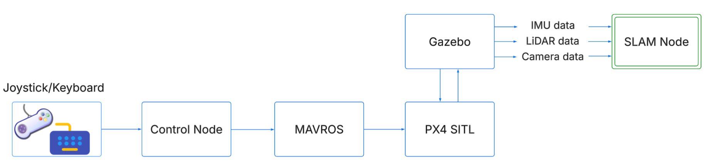

This branch was established to integrate, test, and benchmark state-of-the-art SLAM (Self Localization and Mapping) algorithms for drones in simulation with the goal of mapping an indoor production environment.

🖧 System Architecture 
-----


💻 Software Requirements
-----

* **Ubuntu 24.04 LTS Noble**
* **ROS2 Jazzy** 
* **Gazebo Harmonic**
* **ROS_GZ**
* **PX4 firmware** installation on Linux: Autopilot software which includes the software-in-the-loop firmware
* **MAVROS** package: Autopilot ROS interface
* **QGroundControl** 
* **teleop_twist_keyboard** package: Teleoperation ROS interface. For reference, see the documentation under: [docs/teleop_docs.py]
* **SLAM package**: FAST-LIO2 (https://github.com/Ericsii/FAST_LIO_ROS2)

⚙️ Installation Guide
-----

- First of all clone the repository to your local directory:
```bash
    mkdir -p slam_ws/src/
    cd slam_ws/
    colcon build
    echo "source /opt/ros/jazzy/setup.bash" >> ~/.bashrc 
    echo "source ~/slam_ws/install/setup.bash" >> ~/.bashrc 
    cd src/
    git clone -b dev_slam --single-branch https://github.com/match-MobRob2/match-drone/  
```

### For a one-time setup, please launch this bash script (Still in progress 🚧🛠️🔜)
```bash
    cd match-drone/setup/
    chmod +x setup_entire_workspace.sh 
    ./setup_entire_workspace.sh
```
### For a step-by-step installation, follow the following commands:

1. For installing **ROS2 jazzy**, **PX4**, **MAVROS**, **QGroundControl** and load custom models to PX4 run the following bash script or follow a step-by-step installation guide on the main branch of the repository:
```bash
    cd setup/
    chmod +x setup.sh 
    ./setup.sh  
```
- **(Note)** Everytime you modify the **model.sdf** under "*/match_models*", do the following to let PX4 know about the modifications:
```bash
    cd ~/slam_ws/src/match-drone/match_models/
    ./install_models.sh
```

2. Install gazebo harmonic (https://gazebosim.org/docs/harmonic/install_ubuntu/):
```bash
    chmod +x gazebo_harmonic_setup.sh 
    ./gazebo_harmonic_setup.sh  
```
- To test if gazebo works launch "**gz sim**".
- To check gazebo's installed version, run "**echo $GZ_VERSION**". If it is not harmonic, set it manually: "**export GZ_VERSION=harmonic**".


3. Install and compile ros-gz from source (https://github.com/gazebosim/ros_gz/tree/jazzy?tab=readme-ov-file):
```bash
    chmod +x ros_gz_setup.sh 
    ./ros_gz_setup.sh  
```

4. Install FAST-LIO2:
```bash
    chmod +x fast_lio2_setup.sh 
    ./fast_lio2_setup.sh  
```
- common issue while running "**cmake .. && make -j**" -> (SOLVED): Check out @lukeliao's comment on Feb 25: https://github.com/Livox-SDK/Livox-SDK2/issues/90

5. Install required general packages for various nodes throughout codebase:
```bash
   cd ~/slam_ws
   rosdep install --from-paths src --ignore-src -y
   cd setup/
   pip install -r requirements.txt
```

🚀 Bringup Simulation 
-----

0. Run QGroundControl
```bash
   ./QGroundControl-x86_64.AppImage
```

1. Launch sim node
```bash
   ros2 launch match_slam slam_fast_lio2.launch.py
```

2. Operate drone via keyboard (in new terminal)
```bash
   ros2 run teleop_twist_keyboard teleop_twist_keyboard
```

3. Run this custom code to send velocities to PX4 via MAVROS (in new terminal)
```bash
   ros2 run match_control teleop_driven_flight
```
   - Then check if vehicule is "**ARMED**" and on mode "**OFFBOARD**" by listening to following topic:
```bash
   ros2 topic echo /mavros/state
```
   - If for some reason the vehicule's mode is not "**OFFBOARD**" anymore, set it manually using this command:
```bash
   ros2 service call /mavros/set_mode mavros_msgs/srv/SetMode "{custom_mode: 'OFFBOARD'}"
```
   - If both are set, go back to "**teleop_twist_keyboard**" terminal and operate vehicule with keyboared.

4. Run fast-lio2 package using custom YAML params file to start mapping (in new terminal)
```bash
   ros2 run fast_lio fastlio_mapping --ros-args --params-file src/match-drone/match_slam/config/fast_lio2_params.yaml --log-level fast_lio:=debug
```
   or this:
```bash
   ros2 launch fast_lio mapping.launch.py config_path:=/home/daghbeji/match_ws/src/match-drone/match_slam/config config_file:=fast_lio2_params.yaml rviz:=false
```
   - See the documentation for the FAST-LIO2 custom params file under: [docs/know_your_fast-lio2_params_docs.md](docs/Misc/know_your_fast-lio2_params_docs.md)

5. To save recorded map manually (in new terminal)
```bash
   ros2 service call /map_save std_srvs/srv/Trigger
```
   - To see the documentation on saving the recorded map, please refer to the corresponding section in [docs/know_your_fast-lio2_params_docs.md](docs/Misc/know_your_fast-lio2_params_docs.md)

   - To visualize recorded map use pcl_viewer: 
```bash
   pcl_viewer recorded_map1.pcd
```

6. (Optional) Visualize TF Tree (in new terminal)
```bash
   ros2 run rqt_tf_tree rqt_tf_tree
```

📚 Documentation
-----
The fast-lio2 SLAM algorithm originates from the following paper:
```
@article{DBLP:journals/corr/abs-2107-06829,
  author       = {Wei Xu and
                  Yixi Cai and
                  Dongjiao He and
                  Jiarong Lin and
                  Fu Zhang},
  title        = {{FAST-LIO2:} Fast Direct LiDAR-inertial Odometry},
  journal      = {CoRR},
  volume       = {abs/2107.06829},
  year         = {2021},
  url          = {https://arxiv.org/abs/2107.06829},
  eprinttype    = {arXiv},
  eprint       = {2107.06829},
  timestamp    = {Fri, 21 Jun 2024 12:54:52 +0200},
  biburl       = {https://dblp.org/rec/journals/corr/abs-2107-06829.bib},
  bibsource    = {dblp computer science bibliography, https://dblp.org}
}
```
