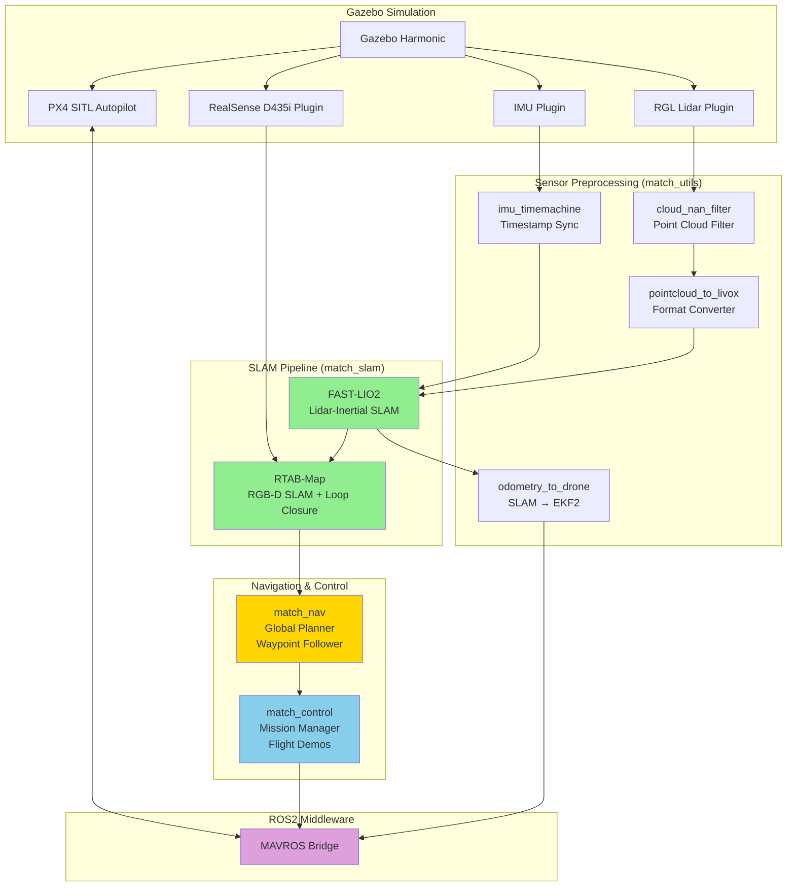
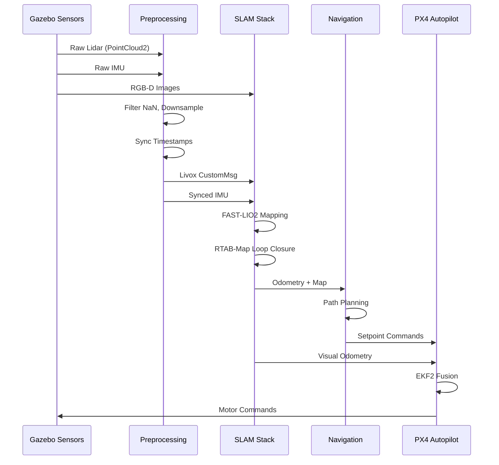

# Match Drone - Autonomous UAV Simulation Platform

<p align="center">
  
  
</p>

<p align="center">
  <a href="https://github.com/match-MobRob2/match-drone">
    
  </a>
  
  
  
  
</p>

<p align="center">
  
  
  
  
</p>

<p align="center">
  <a href="#overview">Overview</a> ·
  <a href="#quick-installation">Quick Install</a> ·
  <a href="#manual-installation">Manual Install</a> ·
  <a href="#running-the-system">Usage</a> ·
  <a href="#architecture">Architecture</a> ·
  <a href="#tutorials">Tutorials</a>
</p>

---

## Overview

**Match Drone** (nicknamed "Marvin") is a ROS2-based autonomous UAV simulation system developed at MATCH Institute for research and education. The platform integrates PX4 SITL autopilot, Gazebo Harmonic simulation, FAST-LIO2 SLAM, GPU-accelerated Lidar, and RGB-D vision for autonomous flight in GPS-denied environments.

### Key Features

- **Full SLAM Pipeline**: FAST-LIO2 (Lidar-Inertial) + RTAB-Map (RGB-D with loop closure)
- **GPU-Accelerated Lidar**: RGL (Robotec GPU Lidar) simulation for real-time point cloud generation
- **Multiple Drone Variants**: Pre-configured models for different sensor configurations
- **Autonomous Navigation**: Waypoint following, mission management, and collision avoidance (in development)
- **PX4 SITL Integration**: Industry-standard autopilot with MAVROS communication

### Tech Stack

| Component | Version | Purpose |
|-----------|---------|---------|
| **ROS2** | Humble | Middleware and node communication |
| **PX4** | SITL (main) | Autopilot simulation |
| **Gazebo** | Harmonic | Physics and sensor simulation |
| **Ubuntu** | 24.04 LTS | Operating system |
| **MAVROS** | Latest | ROS2-PX4 bridge |

---

## Quick Installation


**Automated setup for Ubuntu 24.04 only**

The setup script installs ROS2 (if not present), all dependencies, and configures the workspace automatically.

```bash
cd /path/to/your/ros2_ws/src
git clone https://github.com/match-MobRob2/match-drone/ .
cd misc/
./setup.sh
```

After installation completes, proceed to [Running the System](#running-the-system).

---

## Manual Installation


Follow these steps for manual installation or troubleshooting.

### Prerequisites

- Ubuntu 24.04 LTS
- ROS2 Humble (install via [official guide](https://docs.ros.org/en/humble/Installation.html))
- Git with LFS support
- NVIDIA GPU (recommended for real-time Lidar simulation)

### Step 1: Clone Repository

```bash
cd /path/to/your/ros2_ws/src
git clone https://github.com/match-MobRob2/match-drone/ .
```

### Step 2: PX4 Setup

Build PX4 SITL for Gazebo Harmonic (takes 10–15 minutes on first build):

```bash
git clone https://github.com/PX4/PX4-Autopilot.git --recursive
cd PX4-Autopilot
touch COLCON_IGNORE
bash ./Tools/setup/ubuntu.sh
DONT_RUN=1 make px4_sitl gz_x500
```

### Step 3: Install MAVROS

```bash
cd /path/to/your/ros2_ws/
sudo apt-get install ros-${ROS_DISTRO}-mavros \
                     ros-${ROS_DISTRO}-mavros-extras \
                     ros-${ROS_DISTRO}-mavros-msgs
wget https://raw.githubusercontent.com/mavlink/mavros/master/mavros/scripts/install_geographiclib_datasets.sh
sudo bash ./install_geographiclib_datasets.sh
```

### Step 4: Install QGroundControl

QGroundControl is required for arming and monitoring the drone. The system will not arm without an active QGC connection (PX4 safety feature).

**Installation guide**: [docs/QGroundControl.md](docs/QGroundControl.md)

### Step 5: Install Custom Drone Models

Custom models and worlds must be installed into Gazebo's model directory:

```bash
cd /path/to/your/ros2_ws/src/match_models/
chmod +x install_models.sh
./install_models.sh
```

Rebuild PX4 to register new airframe configurations:

```bash
cd /path/to/your/ros2_ws/src/PX4-Autopilot
DONT_RUN=1 make px4_sitl gz_x500
```

> **Important**: Models are **copied** (not symlinked) to `~/.gz/models/`. After editing files in `match_models/sdf/` or `match_models/worlds/`, re-run `install_models.sh` to apply changes. PX4 rebuild is only needed when adding new drone variants.

For advanced model customization, see [docs/adv_drone_setup.md](docs/adv_drone_setup.md).

---

## Running the System

### Basic Flight Demo

This demo launches the simulation, takes off, flies 2 meters forward, and lands.

```bash
cd /path/to/your/ros2_ws/
colcon build --symlink-install
source install/setup.bash
ros2 launch match_launch x500.launch.py
```

### Full SLAM Stack

Launch the complete system with FAST-LIO2 + RTAB-Map SLAM:

**Terminal 1**: Start simulation
```bash
cd /path/to/your/ros2_ws/
source install/setup.bash
ros2 launch match_launch match_drohne_alles.launch.py
```

**Terminal 2**: Start SLAM pipeline
```bash
source install/setup.bash
ros2 launch match_launch rtabmap_rgbd_fastlio.launch.py
```

**Terminal 3**: Run flight mission
```bash
source install/setup.bash
ros2 run match_control demo_takeoff_square_land
```

### Available Launch Arguments

```bash
ros2 launch match_launch match_drohne_alles.launch.py \
  gz_model:=match_drohne_nogps \  # Drone variant (see table below)
  gz_world:=garbsen \              # World file
  x:=-18.0 y:=0.0 z:=1.0           # Spawn position (ENU coordinates)
```

### Drone Model Variants

| Model | Sensors | Use Case | Autostart ID |
|-------|---------|----------|--------------|
| `match_drohne_alles` | RGB-D + Lidar + IMU + GPS | Full outdoor SLAM | 40014 |
| `match_drohne_nogps` | RGB-D + Lidar + IMU (no GPS) | Indoor/GPS-denied nav | 40015 |
| `match_drohne_lidar` | Lidar + IMU only | Lidar-only SLAM | 40012 |
| `match_drohne_fr_camera` | RGB camera only | Visual tasks | 40013 |
| `match_drohne` | Base model (no sensors) | Template for custom builds | 40011 |

### Demo Flight Scripts

After launching the simulation, run these commands in a new terminal:

```bash
source install/setup.bash

# Simple takeoff and landing
ros2 run match_control demo_takeoff_land

# Takeoff, fly forward 2m, land
ros2 run match_control demo_takeoff_forward_land

# Fly a square pattern
ros2 run match_control demo_takeoff_square_land

# Fly a circular pattern
ros2 run match_control demo_takeoff_circle_land
```

---

## Architecture

### System Overview


```mermaid
graph TB
    subgraph "Gazebo Simulation"
        GZ[Gazebo Harmonic]
        PX4[PX4 SITL Autopilot]
        RGL[RGL Lidar Plugin]
        RS[RealSense D435i Plugin]
        IMU[IMU Plugin]

        GZ --> RGL
        GZ --> RS
        GZ --> IMU
        GZ --> PX4
    end

    subgraph "ROS2 Middleware"
        MAVROS[MAVROS Bridge]

        PX4 <--> MAVROS
    end

    subgraph "Sensor Preprocessing (match_utils)"
        ITM[imu_timemachine<br/>Timestamp Sync]
        CNF[cloud_nan_filter<br/>Point Cloud Filter]
        PTL[pointcloud_to_livox<br/>Format Converter]
        OTD[odometry_to_drone<br/>SLAM → EKF2]

        IMU --> ITM
        RGL --> CNF
        CNF --> PTL
    end

    subgraph "SLAM Pipeline (match_slam)"
        FASTLIO[FAST-LIO2<br/>Lidar-Inertial SLAM]
        RTABMAP[RTAB-Map<br/>RGB-D SLAM + Loop Closure]

        ITM --> FASTLIO
        PTL --> FASTLIO
        RS --> RTABMAP
        FASTLIO --> RTABMAP
        FASTLIO --> OTD
    end

    subgraph "Navigation & Control"
        NAV[match_nav<br/>Global Planner<br/>Waypoint Follower]
        CTRL[match_control<br/>Mission Manager<br/>Flight Demos]

        RTABMAP --> NAV
        NAV --> CTRL
        CTRL --> MAVROS
        OTD --> MAVROS
    end

    style FASTLIO fill:#90EE90
    style RTABMAP fill:#90EE90
    style CTRL fill:#87CEEB
    style NAV fill:#FFD700
    style MAVROS fill:#DDA0DD
```

### Data Flow Pipeline


```mermaid
sequenceDiagram
    participant GZ as Gazebo Sensors
    participant PRE as Preprocessing
    participant SLAM as SLAM Stack
    participant NAV as Navigation
    participant PX4 as PX4 Autopilot

    GZ->>PRE: Raw Lidar (PointCloud2)
    GZ->>PRE: Raw IMU
    GZ->>SLAM: RGB-D Images

    PRE->>PRE: Filter NaN, Downsample
    PRE->>PRE: Sync Timestamps
    PRE->>SLAM: Livox CustomMsg
    PRE->>SLAM: Synced IMU

    SLAM->>SLAM: FAST-LIO2 Mapping
    SLAM->>SLAM: RTAB-Map Loop Closure
    SLAM->>NAV: Odometry + Map

    NAV->>NAV: Path Planning
    NAV->>PX4: Setpoint Commands

    SLAM->>PX4: Visual Odometry
    PX4->>PX4: EKF2 Fusion
    PX4->>GZ: Motor Commands
```

### ROS2 Package Structure

```
match_* (Core Packages)
├── match_control       - Flight missions, state machines, services
├── match_launch        - Launch file orchestration
├── match_models        - Gazebo SDF models, worlds, airframes
├── match_slam          - FAST-LIO2 configuration
├── match_utils         - Sensor preprocessing, timestamp sync
├── match_nav           - Navigation stack (waypoint follower, planner)
└── match_ai            - AI/ML integration (object detection, depth)

External Dependencies (Git Submodules)
├── PX4-Autopilot       - Autopilot simulation
├── FAST_LIO_ROS2       - Lidar-Inertial SLAM
├── RGLGazeboPlugin     - GPU-accelerated Lidar
├── livox_ros_driver2   - Livox message format support
├── DB-TSDF             - Dense mapping (optional)
└── Livox-SDK2          - Livox sensor SDK
```

### Key Topics

| Topic | Type | Hz | Purpose |
|-------|------|----|----|
| `/mavros/local_position/pose` | PoseStamped | 30 | Current drone pose (ENU) |
| `/rgl_lidar` | PointCloud2 | 10 | Raw Lidar point cloud |
| `/mavros/imu/data` | Imu | 100 | IMU measurements |
| `/Odometry` | Odometry | 10 | FAST-LIO2 SLAM output |
| `/mavros/setpoint_position/local` | PoseStamped | - | Position setpoint commands |
| `/match_drohne_alles/front_depth/image_raw` | Image | 30 | Depth camera |
| `/match_drohne_alles/front_depth/color/image_raw` | Image | 30 | RGB camera |

---

## Development Workflow

### Building the Workspace

```bash
cd /path/to/your/ros2_ws/

# Full build
colcon build --symlink-install

# Build specific package
colcon build --packages-select match_control

# Source environment
source install/setup.bash
```

> **Note**: With `--symlink-install`, Python code changes take effect immediately without rebuild.

### Adding a New Flight Mission

1. Create node in `match_control/match_control/your_mission.py`
2. Add entry point in `match_control/setup.py`:
   ```python
   'your_mission = match_control.your_mission:main',
   ```
3. Rebuild: `colcon build --packages-select match_control`

### Modifying Drone Models

1. Edit SDF file in `match_models/sdf/your_model/model.sdf`
2. Run `./install_models.sh` to copy changes to Gazebo
3. (Optional) Rebuild PX4 if adding new airframe:
   ```bash
   cd PX4-Autopilot && DONT_RUN=1 make px4_sitl gz_x500
   ```

### Adjusting SLAM Parameters

Edit `match_slam/config/fast_lio2_params.yaml` (no rebuild needed):

```yaml
preprocess:
  blind: 0.15          # Minimum Lidar range (m)

mapping:
  fov_degree: 60       # Field of view (degrees)
  det_range: 20.0      # Detection range (m)

# Extrinsic calibration (Lidar → IMU)
extrinsic_T: [-0.011, -0.02329, 0.04412]
extrinsic_R: [1, 0, 0, 0, 1, 0, 0, 0, 1]
```

---

## Tutorials

A collection of guided exercises with starter code and reference solutions is available at:

**[docs/tutorials/README.md](docs/tutorials/README.md)**

Topics covered:
- Basic ROS2 node creation
- MAVROS communication
- State machine design for missions
- Sensor data processing
- Custom launch file configuration

---

## Troubleshooting

### Common Issues

**Drone won't arm**
- Ensure QGroundControl is running and connected
- Check PX4 console for error messages
- Verify GPS lock (for GPS-enabled models)

**SLAM not working**
- Check `imu_timemachine` node is running (required for timestamp sync)
- Verify topics: `ros2 topic hz /Odometry` should show ~10Hz
- Review FAST-LIO2 config: `blind` parameter should be > 0.15m

**Gazebo runs slowly**
- RGL Lidar requires NVIDIA GPU for real-time performance
- Reduce point cloud density in `cloud_nan_filter` parameters
- Use simpler drone model (`match_drohne_lidar` instead of `match_drohne_alles`)

**PX4 binary not found**
- Always run launch files from workspace root, not `src/`
- Check PX4 build completed: `ls PX4-Autopilot/build/px4_sitl_default/bin/px4`

---

## Documentation

- **[CLAUDE.md](CLAUDE.md)** - AI assistant project context and guidelines
- **[misc/PROJECT.md](misc/PROJECT.md)** - Detailed architecture documentation
- **[misc/STATE.md](misc/STATE.md)** - Implementation status and roadmap
- **[docs/QGroundControl.md](docs/QGroundControl.md)** - QGC installation guide
- **[docs/adv_drone_setup.md](docs/adv_drone_setup.md)** - Advanced model customization

---

## Contributing

Contributions are welcome! Please follow these guidelines:

1. Follow existing code style (see [CLAUDE.md](CLAUDE.md))
2. Test changes in simulation before submitting PR
3. Update relevant documentation
4. Write meaningful commit messages

---

## License

This project is developed at MATCH Institute for research and educational purposes.

---

## Acknowledgments


Developed by the Match-MobRob2 Team at MATCH Institute.

**External Dependencies**:
- [PX4 Autopilot](https://px4.io/)
- [FAST-LIO2](https://github.com/hku-mars/FAST_LIO)
- [RGL (Robotec GPU Lidar)](https://github.com/RobotecAI/RobotecGPULidar)
- [RTAB-Map](http://introlab.github.io/rtabmap/)
- [MAVROS](https://github.com/mavlink/mavros)
