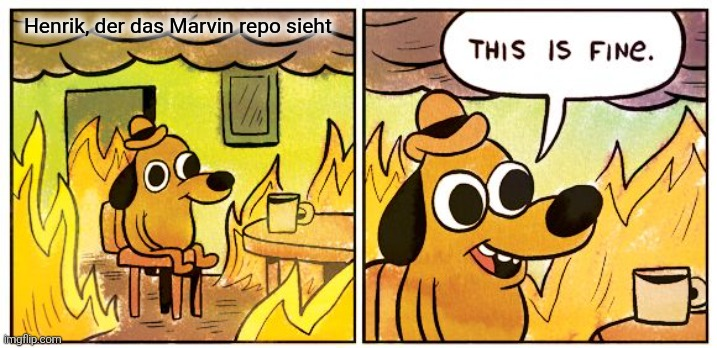

# 🕊️ Mächtige Match Möve Marvin
<!-- Peak Engineering: eine Möve, die fliegt. -->

<p align="center">
  
  
  
</p>

<p align="center">
  <a href="https://github.com/match-MobRob2/match-drone">
    
  </a>
  
  
  
  
</p>

<p align="center">
  
  
  
  
  
</p>

<p align="center">
  <a href="#-overview">Overview</a> ·
  <a href="#installation-mit-setup-skript">Setup-Skript</a> ·
  <a href="#-installations-in-einzel-schritten">Install steps</a> ·
  <a href="#-running-the-demo">Demo</a> ·
  <a href="#%EF%B8%8F-custom-drone-model-setup">Custom Models</a> ·
  <a href="#-tutorial-aufgaben">Tutorials</a>
</p>

---

## 🚁 Overview

**Match Drohne** — aka. Marvin the Seagull.

<p align="center">
  
  
</p>

<details>
<summary><strong>Warum Marvin? (bitte klicken, wichtig für die Wissenschaft)</strong></summary>

- Weil "Drohne" zu normal ist.
- Weil eine Möve grundsätzlich immer Recht hat.
- Weil ohne Lore kein Repo vollständig ist.

</details>

---

## Installation mit Setup Skript


<p>
  
  
</p>

Installiert ROS2 (falls nicht vorhanden) und alles andere.  
**Wichtig: Nur für Ubuntu 24.04**

```bash 
cd /path/to/your/ros2_ws/src
git clone https://github.com/match-MobRob2/match-drone/ .
cd misc/
./setup.sh
````

---

## 📦 Installations in einzel Schritten


<p>
  
  
</p>

### 1. Navigate to the `src` Directory

```bash
cd /path/to/your/ros2_ws/src
```

### 2. Clone the Repository

```bash
git clone https://github.com/match-MobRob2/match-drone/ .
```

### 3. PX4 Setup (10–15 minutes)

<p>
  
</p>

```bash
git clone https://github.com/PX4/PX4-Autopilot.git --recursive
cd PX4-Autopilot
touch COLCON_IGNORE
bash ./Tools/setup/ubuntu.sh
DONT_RUN=1 make px4_sitl gz_x500
```

### 4. Install MAVROS

```bash
cd /path/to/your/ros2_ws/
sudo apt-get install ros-${ROS_DISTRO}-mavros ros-${ROS_DISTRO}-mavros-extras ros-${ROS_DISTRO}-mavros-msgs
wget https://raw.githubusercontent.com/mavlink/mavros/master/mavros/scripts/install_geographiclib_datasets.sh
sudo bash ./install_geographiclib_datasets.sh
```

### 5. Install QGroundControl

Für den Betrieb der Drohne wird QGroundControl benötigt. Damit lässt sich Telemetrie empfangen und Befehle an die Drohne senden. Auch im späteren Realbetrieb wird die Software verwendet.

<strong>Wichtig:</strong> Ohne eine verbundene QGroundControl-Instanz hebt die Drohne aus Sicherheitsgründen nicht ab.

[QGroundControl Installation Guide](docs/QGroundControl.md)

### 6. Install Custom Models

Damit eigene Drohnenmodelle genutzt werden können, müssen einige Dateien in der Simulationsumgebung angepasst bzw. ergänzt werden. Zum Glück hat ein kleiner Tastatur-Affe (ich) dafür ein Skript gemacht:

<p>
  
</p>

```bash
cd /path/to/your/ros2_ws/src/match_models/
chmod +x install_models.sh
./install_models.sh
```

Anschließend muss der Simulator erneut gebaut werden. Das dauert diesmal nicht mehr so lange:

```bash
cd /path/to/your/ros2_ws/src/PX4_Autopilot
DONT_RUN=1 make px4_sitl gz_x500
```

<strong>Wichtig:</strong> Die Modelle werden von dem "install_models.sh" skript in Ordner des Simulators kopiert. Das heißt wenn man Modelle in "match_models/sdf" oder "match_models/worlds" verändert bekommt der Simulator davon nichts mit. Nur nach erneutem ausführen des "install_models.sh" Skripts werden veränderungen übernommen.

Ein erneutes ausführen von "DONT_RUN=1 make px4_sitl gz_x500" ist bei einfachen veränderungen der SDF dateien nicht notwendig. Nur wenn man ganz neue Drohnen Varianten anlegt. Mehr details gibts hier: [Advanced Custom Modells Setup](docs/adv_drone_seup.md)

---

## 🚀 Running the Demo

Die Demo startet eins der Standardmodelle des Simulators, hebt ab, fliegt zwei meter nach vorne und landet.

<p>
  
  
</p>

```bash
cd /path/to/your/ros2_ws/
colcon build --symlink-install
source install/setup.bash
ros2 launch match_launch x500.launch.py
```

---

## 🛠️ Custom Drone Model Setup

For instructions on setting up the custom drone model, see [match_models/Drone_Guide.md](match_models/Drone_Guide.md).

---

## 🎓 Tutorial-Aufgaben

Eine Sammlung von Übungsmissionen mit Startcode und Musterlösungen findest du unter [docs/tutorials/README.md](docs/tutorials/README.md).

---

<details>
<summary><strong>Bonus: Marvin-Statusanzeigen (komplett seriös)</strong></summary>

* ✅ Läuft (mit genug Kaffee)
* ⚠️ Manchmal macht Marvin Marvin-Dinge
* 🧠 Debugging-Level: „kann man machen“

</details>


<!--
Easter Egg:
Du bist doof
-->

