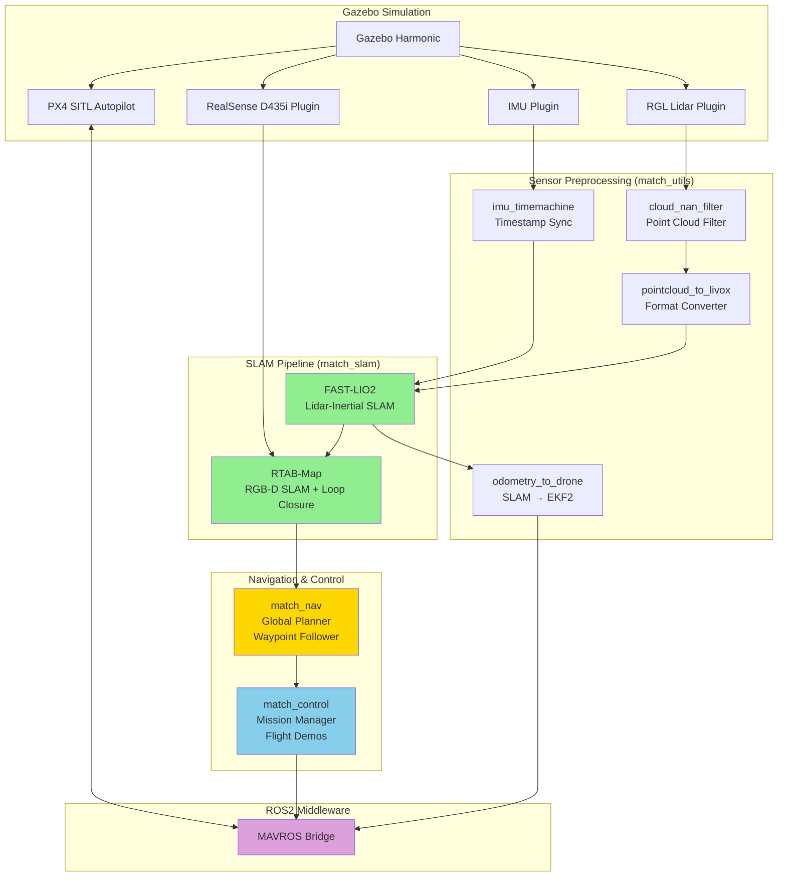
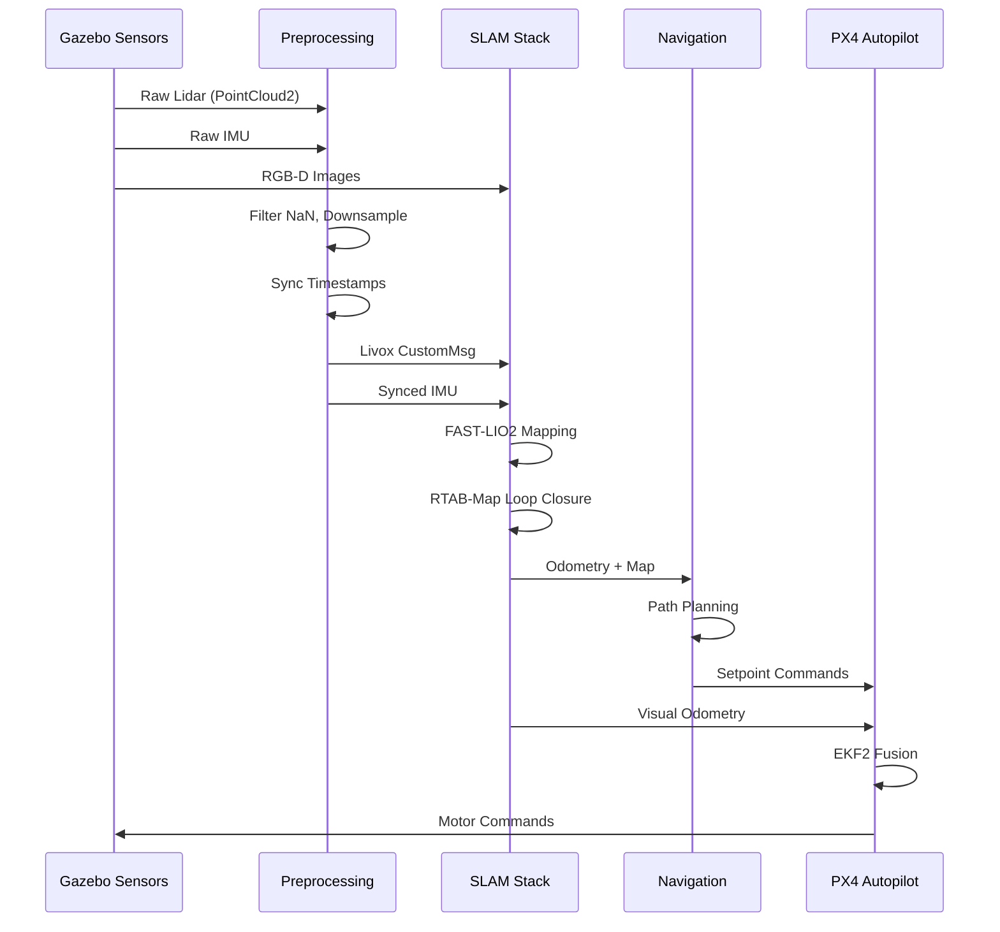

# Match Drone - Autonomous UAV Simulation Platform

<p align="center">
  
  
</p>

<p align="center">
  
  
  
  
</p>

---

## Overview

ROS2-based autonomous UAV simulation system integrating PX4 SITL, Gazebo Harmonic, FAST-LIO2 SLAM, and GPU-accelerated Lidar (RGL) for autonomous flight research.

**Key Components:**
- FAST-LIO2 Lidar-Inertial SLAM
- RTAB-Map RGB-D SLAM with loop closure
- PX4 SITL autopilot
- Multiple sensor configurations (Lidar, RGB-D, IMU, GPS)

**Tech Stack:** ROS2 Humble | PX4 SITL | Gazebo Harmonic | Ubuntu 24.04

---

## Architecture

### System Overview


```mermaid
graph TB
    subgraph "Gazebo Simulation"
        GZ[Gazebo Harmonic]
        PX4[PX4 SITL Autopilot]
        RGL[RGL Lidar Plugin]
        RS[RealSense D435i Plugin]
        IMU[IMU Plugin]

        GZ --> RGL
        GZ --> RS
        GZ --> IMU
        GZ --> PX4
    end

    subgraph "ROS2 Middleware"
        MAVROS[MAVROS Bridge]

        PX4 <--> MAVROS
    end

    subgraph "Sensor Preprocessing (match_utils)"
        ITM[imu_timemachine<br/>Timestamp Sync]
        CNF[cloud_nan_filter<br/>Point Cloud Filter]
        PTL[pointcloud_to_livox<br/>Format Converter]
        OTD[odometry_to_drone<br/>SLAM → EKF2]

        IMU --> ITM
        RGL --> CNF
        CNF --> PTL
    end

    subgraph "SLAM Pipeline (match_slam)"
        FASTLIO[FAST-LIO2<br/>Lidar-Inertial SLAM]
        RTABMAP[RTAB-Map<br/>RGB-D SLAM + Loop Closure]

        ITM --> FASTLIO
        PTL --> FASTLIO
        RS --> RTABMAP
        FASTLIO --> RTABMAP
        FASTLIO --> OTD
    end

    subgraph "Navigation & Control"
        NAV[match_nav<br/>Global Planner<br/>Waypoint Follower]
        CTRL[match_control<br/>Mission Manager<br/>Flight Demos]

        RTABMAP --> NAV
        NAV --> CTRL
        CTRL --> MAVROS
        OTD --> MAVROS
    end

    style FASTLIO fill:#90EE90
    style RTABMAP fill:#90EE90
    style CTRL fill:#87CEEB
    style NAV fill:#FFD700
    style MAVROS fill:#DDA0DD
```

### Data Flow Pipeline


```mermaid
sequenceDiagram
    participant GZ as Gazebo Sensors
    participant PRE as Preprocessing
    participant SLAM as SLAM Stack
    participant NAV as Navigation
    participant PX4 as PX4 Autopilot

    GZ->>PRE: Raw Lidar (PointCloud2)
    GZ->>PRE: Raw IMU
    GZ->>SLAM: RGB-D Images

    PRE->>PRE: Filter NaN, Downsample
    PRE->>PRE: Sync Timestamps
    PRE->>SLAM: Livox CustomMsg
    PRE->>SLAM: Synced IMU

    SLAM->>SLAM: FAST-LIO2 Mapping
    SLAM->>SLAM: RTAB-Map Loop Closure
    SLAM->>NAV: Odometry + Map

    NAV->>NAV: Path Planning
    NAV->>PX4: Setpoint Commands

    SLAM->>PX4: Visual Odometry
    PX4->>PX4: EKF2 Fusion
    PX4->>GZ: Motor Commands
```

### Package Structure

```
match_* (Core Packages)
├── match_control       - Flight missions, state machines, services
├── match_launch        - Launch file orchestration
├── match_models        - Gazebo SDF models, worlds, airframes
├── match_slam          - FAST-LIO2 configuration
├── match_utils         - Sensor preprocessing, timestamp sync
├── match_nav           - Navigation stack (waypoint follower, planner)
└── match_ai            - AI/ML integration (object detection, depth)

External Dependencies (Git Submodules)
├── PX4-Autopilot       - Autopilot simulation
├── FAST_LIO_ROS2       - Lidar-Inertial SLAM
├── RGLGazeboPlugin     - GPU-accelerated Lidar
├── livox_ros_driver2   - Livox message format support
├── DB-TSDF             - Dense mapping (optional)
└── Livox-SDK2          - Livox sensor SDK
```

---

## Documentation

- **[CLAUDE.md](CLAUDE.md)** - Project instructions and development guidelines
- **[misc/PROJECT.md](misc/PROJECT.md)** - Detailed architecture documentation
- **[misc/STATE.md](misc/STATE.md)** - Implementation status and roadmap

---


