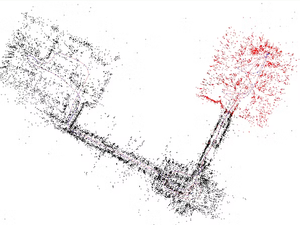
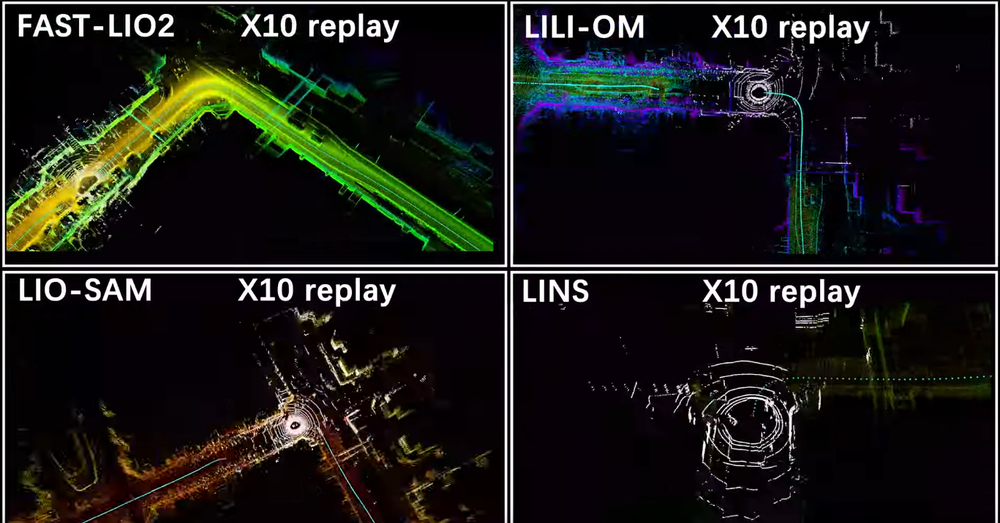
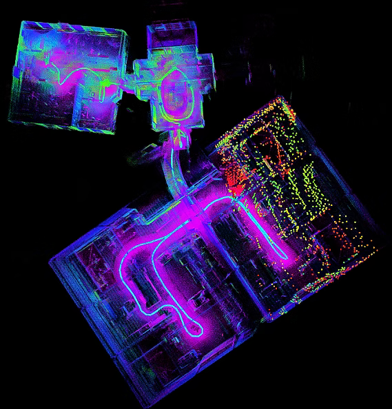
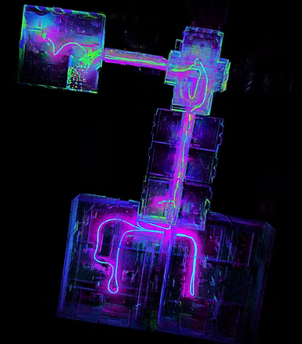

## Vor- und Nachteile der Sensoren

* **Kamera** baseline
-> sehr gute lokalisierung: sogar besser als LiDAR, da Kamera erkennt Formen + Farbinformationen, LiDAR erkennet nur Muster 
-> kein zentimetergenaues Mapping, weil: 
    1) Begrenzte effektive Reichweite
    2) Geringe Kamera-Baseline (Distanz zwischen beiden Kameras bei einer Stereo-Kamera) reduziert die Tiefengenauigkeit auf große Distanzen
    3) Aufwendige Kalibrierung (calibration software needed)
    4) unfähig aggressive Bewegungen zu verarbeiten -> verursacht verzerrtes Output
        -> eignet sich mehr für Roboter als für Drohnen 
    5) for accuracy take two cameras+ depth camera, so more software

* **LiDAR**:
    - ideals zentimetergenaues Mapping
    - frequency: Muss mindestens 10 Hz, 20 Hz ist ideal (da sich die Drohne volatile Bewegungen zurücklegt)
        -> livox mid360 hat 10 Hz Frequenz, kann man vllt den Hersteller fragen, ob eine Variante mit 20Hz verfügbar wäre?

    - Blindwinkel/bereich: lidar so ansetzen, dass der blindwinkel mit IR-Kamera (Realsense) kompensieren: IR-Sensor berechnet depth (bis 8 Meter Reichweite) und Kamera gibt an wo Objekt sich befindet
    -> Zweck: Hindernisserkennung in unmittelbarer Nähe, Safe Landing

## State of the art SLAM algorithms

* ORB-SLAM3 Issues: 
    - sparse detail-poor output map (yumao)
        
        -> macht die Navigation schwieriger

* Fast-LIO/Fast-LIO2 vs LIO-SAM,LILI-OM: 
    
    - capable of processing data in very fast speed Due to EKF
    - dense detail-rich ouput map
    
    - Hardware-friendly
    - Quelle: https://github.com/hku-mars/FAST_LIO/blob/ROS2/doc/Fast_LIO_2.pdf

    BUT:
    - No loop-closure
        -> Solution:  FAST-LIO with Loop closure 
        - https://www.youtube.com/watch?v=bO7jQo7DQpw&list=PLOOn04FL6kRgT9yJAsP7N7m_xye245QEO&index=3
    - fails when facing degenerated environment like featureless long corridor
        

-> Solution: hybrid approach: Use ORB-SLAM3 + fast-LIO2
