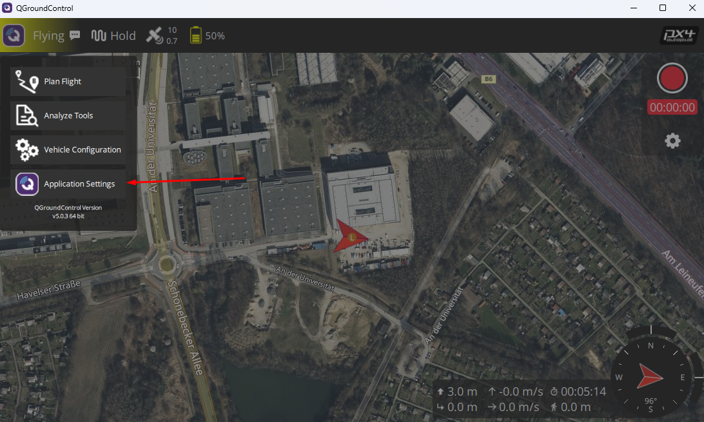
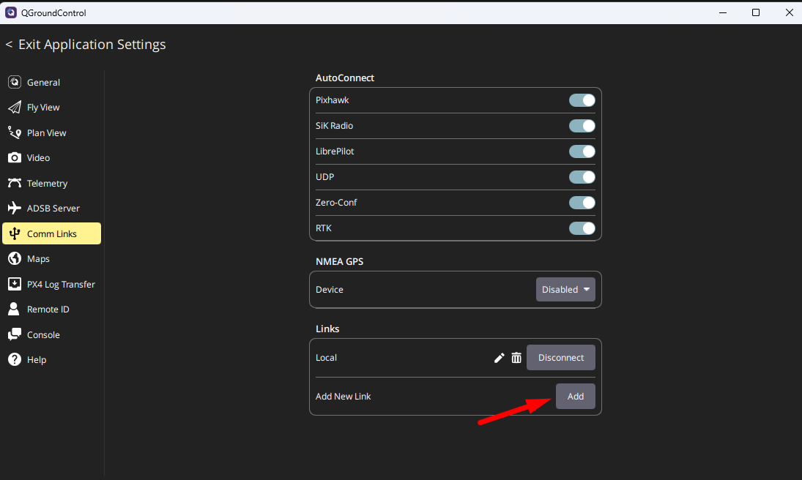
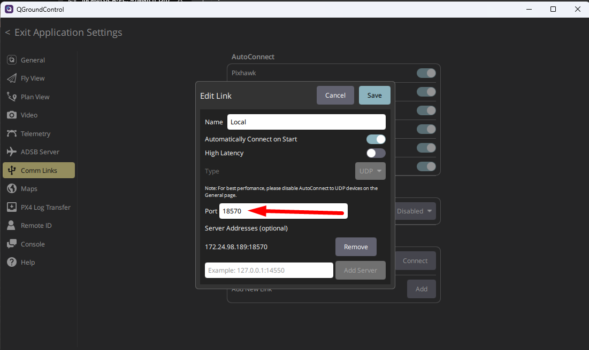
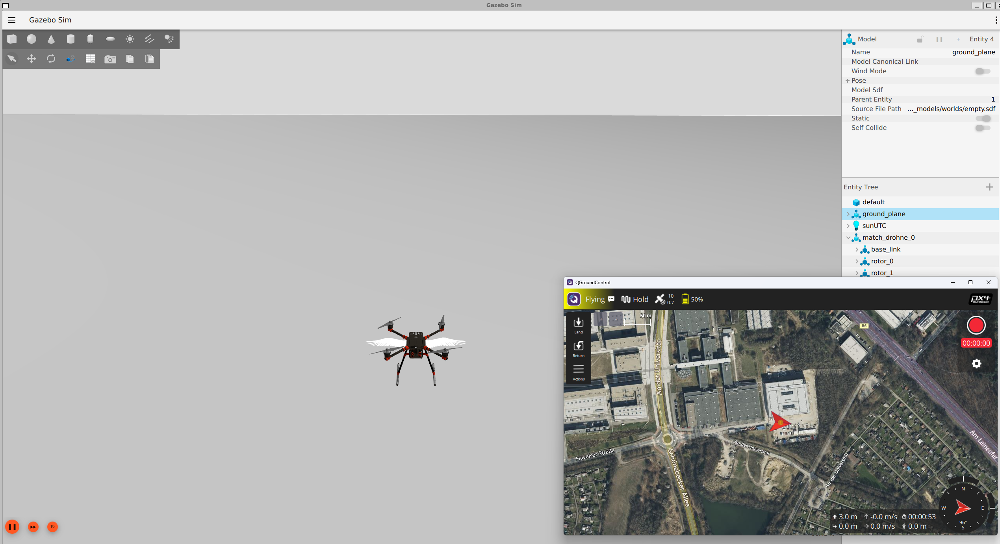

# QGroundControl Anleitung

## 1. QGroundControl herunterladen

Die Software kann für das entsprechende Betriebssystem über den folgenden Link heruntergeladen werden:  
[QGroundControl Download](https://docs.qgroundcontrol.com/master/en/qgc-user-guide/getting_started/download_and_install.html)

---

## 2. Einrichtung der Verbindung

### **Schritt 1: Einstellungen öffnen**  

---

### **Schritt 2: Comm Link hinzufügen**  

---

### **Schritt 3: Richtigen Port einstellen**  

---

## 3. Simulation starten

Beim Start einer Simulation sollte sich QGroundControl automatisch verbinden:  
